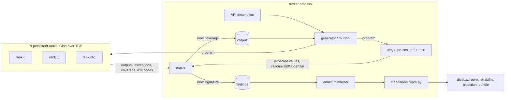

# distfuzz

Fuzzers for the distributed layer of PyTorch: `torch.distributed` collectives on Gloo, DTensor sharding, and distributed checkpointing (DCP). The design follows [syzkaller](https://github.com/google/syzkaller): programs are generated from typed API descriptions, run on a persistent set of worker ranks, judged by oracles, deduplicated, minimized and turned into standalone repros.

This is a capstone research prototype. It has found bugs that still reproduce on the latest PyTorch release and on a nightly build (table below). It is not yet a research-grade fuzzer; see [Status](#status).

## Why

Distributed training bugs rarely crash. They show up as a wrong gradient on one rank, a desync that turns into a timeout ten minutes later, or a checkpoint that loads without error and silently restores nothing. Upstream tests for this layer mostly use evenly divisible shapes, one placement at a time, and a single mesh. distfuzz goes after the space those tests skip: uneven and empty shards, `Partial` placements, strided views, in-place ops, rank-divergent programs, and reloading checkpoints under a different world size and parallelism.

Each fuzzer is differential. It runs the same program twice, once through the distributed API and once through a single-process reference, and reports any difference.

## Components

| Package | Target | Oracle |
|---|---|---|
| `distfuzz.collectives` | c10d collectives and p2p on Gloo (22 calls described), with per-rank divergence | A single-process model of all ranks predicts every tensor on every rank. Sentinel cells around each buffer catch writes outside a view. Also: crash, hang, error on a valid program, silent acceptance of an invalid one. |
| `distfuzz.dtensor` | DTensor ops (about 150 templates, Shard/Replicate/Partial on 1-D and 2-D meshes, autograd, `torch.compile`) | `full_tensor()` must equal the same program on plain tensors; also shapes, local shard shapes, gradients, and whether all ranks raise the same error. |
| `distfuzz.dcp` | `torch.distributed.checkpoint` save/load and `get_state_dict`/`set_state_dict` across FSDP2, TP, HSDP, DDP and 2-D meshes | Checkpoints are reloaded into a poisoned model under a different world size and parallelism; loaded state must match saved state bitwise, and training must match an unsharded reference. |
| `distfuzz.repro` | Any finding or repro script | syzbot-style bundle: reliability over N fresh containers, bisection across 12 torch releases, pinned Dockerfile, report, dashboard. |

## How it maps to syzkaller

| syzkaller | distfuzz | Gap |
|---|---|---|
| syzlang descriptions, typed resources | `collectives/desc.py` (resources `tensor`, `group`, `work`, `list`); `dtensor/gen.py` op templates | A Python table, not a language; no extraction from docs or OpInfo |
| `prog/` generation and mutation | `prog.py`, `gen.py`: insert, remove, mutate argument, splice, plus `diverge` (one rank skips or changes a call) | No learned choice table (`prog/prio.go`) |
| executor with fork server | Persistent rank processes, fresh process group per program, restart on hang or crash; about 17x faster than a fresh world per program | One session at a time |
| kcov coverage | `sys.monitoring` line coverage of `torch/distributed` | Python only; the C++ in Gloo and `ProcessGroupGloo.cpp`, where the bugs are, is invisible |
| KASAN | GUARD sentinel oracle; differential reference models | No sanitizer build of Gloo or c10d yet |
| `pkg/repro`, `pkg/bisect`, syzbot dashboard | ddmin minimizers, `distfuzz.repro` (reliability, release bisection, static dashboard) | Release-level bisection only, no commit bisection |

## Architecture



## Quickstart

Everything that starts more than one rank runs in Docker. Crashing ranks are the point of the exercise, and on a laptop host they bring up OS crash dialogs and starve the machine.

```bash
make docker                                  # distfuzz:cpu, python 3.12 + torch 2.14.0 CPU
docker run --rm -it --memory 3g --cpus 4 --shm-size 1g -v "$PWD/runs:/src/runs" distfuzz:cpu bash

# inside the container
python -m distfuzz.collectives fuzz --mode random --minutes 5 --out runs/collectives
python -m distfuzz.collectives minimize runs/collectives/findings/<id>.json
python -m distfuzz.dtensor fuzz --mode guided --world 4 --minutes 5 --out runs/dtensor
python -m distfuzz.dcp fuzz --mode guided --minutes 5 --out runs/dcp

torchrun --nproc-per-node 4 examples/repros/collectives/gloo_strided_sweep.py
```

Another torch build: `docker build --build-arg TORCH_SPEC=torch --build-arg TORCH_INDEX=https://download.pytorch.org/whl/nightly/cpu -t distfuzz:nightly .`

Host-only development (no ranks): see [CONTRIBUTING.md](CONTRIBUTING.md).

## Verified bugs

Every row reproduces from a plain PyTorch script with no distfuzz imports, on torch 2.14.0 and nightly 2.15.0.dev20260926, CPU/Gloo. "Not previously reported" means a search of the pytorch/pytorch tracker found no duplicate; nothing has been filed upstream yet. The Gloo and DTensor rows were re-checked by a separate verification pass that wrote its own repros (20/20 runs each unless noted).

| Area | Bug | Status | Upstream |
|---|---|---|---|
| Gloo | `all_reduce` and `reduce_scatter` on a strided, non-dense view return wrong values on every rank and write into the holes of the view's span; `expand`ed views write past the allocation | Not previously reported for these ops; deterministic from 2.1.2 to nightly | Related: [#192920](https://github.com/pytorch/pytorch/issues/192920); open fix [PR #191187](https://github.com/pytorch/pytorch/pull/191187) does not cover these two ops |
| Gloo | `reduce`, `broadcast`, `scatter` on strided views: wrong values | Known | [#192920](https://github.com/pytorch/pytorch/issues/192920), [#24836](https://github.com/pytorch/pytorch/issues/24836) |
| Gloo | `resize_` or `set_` on a tensor while an async collective on it is in flight: uncatchable SIGABRT, sometimes SIGSEGV | 10/10 on 2.14 and nightly, also with contiguous tensors. Arguably API misuse, but Python code should not be able to corrupt memory. Not independently verified | Related: [#81684](https://github.com/pytorch/pytorch/issues/81684) (same `pair.cc` enforce) |
| DTensor | `flatten()` / `view(-1)` of a zero-size DTensor loops forever in `view_groups` | Not previously reported | none found |
| DTensor | `mse_loss`, `smooth_l1_loss`, `huber_loss` (mean) with uneven shards: NaN, or a silent ~15% error without an empty shard | Not previously reported | Sibling of [#185167](https://github.com/pytorch/pytorch/issues/185167); [#162692](https://github.com/pytorch/pytorch/issues/162692) fixed `mean` but the decomposition path bypasses that fix |
| DTensor | Full `max()`/`min()` with an empty shard: some ranks raise, others enter the collective (desync) | Not previously reported | Related: [#143372](https://github.com/pytorch/pytorch/issues/143372) |
| DTensor | `vector_norm(ord=inf)` on a `Partial(max)` input: wrong value; correct on 2.10.0, wrong again from 2.11.0 | Not previously reported | none found |
| DTensor | Embedding output (`_MaskPartial`) can be reduced only once in eager mode | Not previously reported (compile variants known) | Related: [#160697](https://github.com/pytorch/pytorch/issues/160697), [#159843](https://github.com/pytorch/pytorch/issues/159843) |
| DTensor | `squeeze()` on a zero-size DTensor moves the shard dim | Not previously reported | Non-empty case: [#166124](https://github.com/pytorch/pytorch/issues/166124) (fixed) |
| DTensor | `x[i] = v` on a sharded dim is silently dropped | Known class | [#147570](https://github.com/pytorch/pytorch/issues/147570) |
| DTensor | Backward through `split(...)[k]` fails with mixed Tensor/DTensor | Known | [#118461](https://github.com/pytorch/pytorch/issues/118461), [PR #198429](https://github.com/pytorch/pytorch/pull/198429) |
| DTensor | `fill_` on `Partial(sum)` keeps the Partial (gives 12, not 3) | By design: an upstream test asserts it | [#172485](https://github.com/pytorch/pytorch/issues/172485) |
| DCP | `DefaultLoadPlanner(flatten_state_dict=False)` drops every non-tensor value, and with nested dicts the whole model and optimizer, while `dcp.load` returns normally | No duplicate found. Not independently verified | none found |
| DCP | `set_state_dict(full_state_dict=True, broadcast_from_rank0=True)` with the empty dicts that `get_state_dict(..., cpu_offload=True)` returns on non-zero ranks: rank-divergent collectives, hang | No duplicate found. Not independently verified | Probable cause of [#157781](https://github.com/pytorch/pytorch/issues/157781) |
| DCP | `set_state_dict(full_state_dict=True, flatten_optimizer_state_dict=True)` cannot load `get_state_dict`'s own output (`KeyError`) | No duplicate found. Not independently verified | Related: [#192224](https://github.com/pytorch/pytorch/issues/192224), [#137327](https://github.com/pytorch/pytorch/issues/137327) |
| DCP | Full `set_state_dict` fails for an optimizer with no tensor state (SGD, `momentum=0`) | No duplicate found. Not independently verified | Related: [#192225](https://github.com/pytorch/pytorch/issues/192225) |
| DCP | `SGD(fused=True)` on DTensor params: no sharding strategy for `_fused_sgd_` | No duplicate found (loud, a coverage gap) | none found |
| DCP | `RowwiseParallel` on a Linear with fewer input features than the TP degree: weight is `Shard(1)`, grad comes back `Replicate` | No duplicate found. Not independently verified | Same family as [#150336](https://github.com/pytorch/pytorch/issues/150336) |

Standalone repros are in [`examples/repros/`](examples/repros). Release bisection (2.4.1 to nightly) of the nine bundled Gloo and DTensor bugs found none fixed in any tested build.

## Status

Verdict from an independent review against syzkaller and published DL fuzzers: **prototype** (on a toy, prototype, research-grade scale).

What holds up:
- The oracles are the strongest part: a cell-by-cell reference model for collectives (111 multi-rank tests check the model and the executor against real Gloo), a sentinel oracle that turned "wrong result" into "writes outside the view", and cross-rank error-symmetry checks.
- Findings minimize to 1 to 4 calls and reproduce deterministically.

What does not, yet:
- Coverage guidance is not earning its keep. Python line coverage saturates within minutes and cannot see the C++ where every confirmed bug lives. In a 30-minute comparison, guided collectives fuzzing found fewer distinct signatures than random mode; for DTensor, guidance added about 1% coverage.
- A single-op property test of about 250 lines rediscovers most of the headline bugs within minutes. So far the multi-call program machinery is not what finds bugs; baselines at equal budget are the next thing to run.
- The fuzz loop does not deflake findings or reload its corpus between runs. `distfuzz.repro` measures reliability after the fact.
- API breadth: 20 of 26 c10d collective and p2p calls, 86 of 364 DTensor sharding-strategy ops. Gloo on CPU only; NCCL is untested.
- Campaigns so far are 15 to 75 minutes on 4 CPUs.

[BACKLOG.md](BACKLOG.md) has the roadmap in priority order.

## Repository layout

```
src/distfuzz/
  collectives/   c10d/Gloo fuzzer
  dtensor/       DTensor differential fuzzer
  dcp/           checkpoint save/load/reshard fuzzer
  repro/         repro bundles, reliability, release bisection
tests/           host tests; multi-rank tests are marked `multirank`
examples/repros/ plain PyTorch repros for the bugs above
docs/            PR guide
```

## Contributing

See [CONTRIBUTING.md](CONTRIBUTING.md) and [docs/PR_GUIDE.md](docs/PR_GUIDE.md).

## License

MIT, see [LICENSE](LICENSE).
